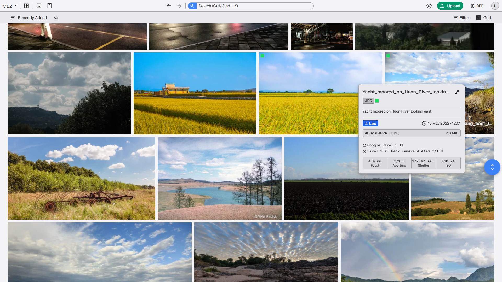

# viz

<a href="https://opensource.org/license/agpl-v3"></a>

**viz** is a self-hosted image management and processing platform designed for photographers and media teams. It organizes large photo libraries, extracts deep camera metadata, and processes high-resolution imagery with instant responsiveness.



> [!WARNING]
> This project is in active development. Features and APIs may change frequently. Feedback and contributions are welcome!


## Capabilities & Highlights

- **High-Performance Image Engine**: Fast image transformations, smart resizing, RAW/DNG preview extraction, and instant multi-resolution thumbnail generation.
- **Asynchronous Processing Queue**: Heavy media tasks (generation, conversions, and metadata indexing) are offloaded to an asynchronous background worker queue so uploads and UI browsing remain fast and responsive.
- **Real-Time Live Updates**: Instant UI state synchronization as background jobs finish processing your files.
- **Deep EXIF & Camera Intelligence**: Automatic extraction of exposure stats, camera bodies, lenses, focal lengths, color profiles, and timestamps.
- **Smart Collections & Search**: Organize your library into curated collections with fast token-based search across tags, filenames, and camera metadata.
- **viewfinder Interface**: A clean, responsive workspace featuring fluid image grids, dynamic zoom scaling, batch operations, and drag-and-drop uploads.
- **Self-Hosted & Private**: Total ownership of your data, however and wherever you want.


## Quick Start

Get started quickly using [Docker Compose](https://docs.docker.com/compose/).

### 1. Clone & Configure:
```bash
git clone https://github.com/garvageart/viz.git
cd viz

# Configure environment variables
cp .env.example .env
```

### 2. Run:
```bash
docker compose -f docker/docker-compose.yml up --build -d
```

### 3. Open:
Visit **`http://localhost:7770`** in your browser.

For complete setup guides and manual development instructions, see [**BUILDING.md**](./docs/setup/BUILDING.md).


## Documentation

- [**Building & Setup Guide**](./docs/setup/BUILDING.md): Detailed local development setup and prerequisites.
- [**UI Design System**](./docs/development/UI_DESIGN_SYSTEM.md): Visual design tokens, spacing, and styling rules.
- [**API Specification**](./api/openapi/openapi.yaml): Full OpenAPI documentation.


## License

This project is licensed under the GNU Affero General Public License v3.0 (AGPL-3.0). See [LICENSE](./LICENSE) for details.

---

## Questions & Feedback?

We welcome questions, feedback, and contributions! Here is how you can get in touch:

- **Bugs & Feature Requests**: If you find a bug or have a new feature idea, please search the existing issues or open a new one.
- **Support & Discussions**: For setup help, general questions, or architectural ideas, please start a thread in the repository discussions.
- **Contributions**: Pull requests are welcome! If you are interested in contributing code or documentation, feel free to open a pull request or start a discussion to align on changes.

Copyright (c) 2026 Les
