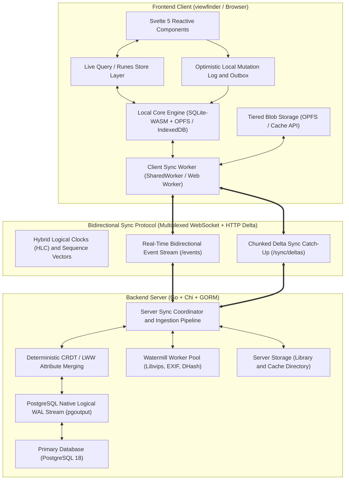
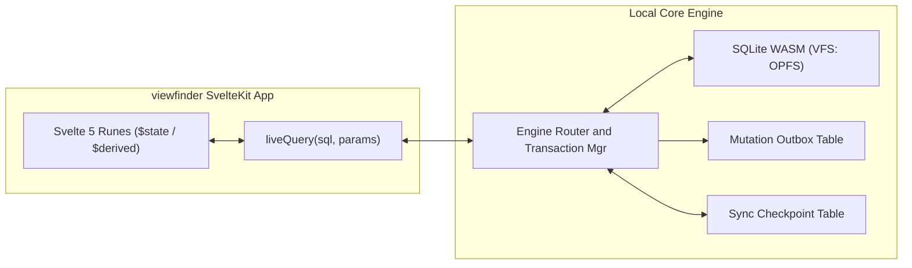
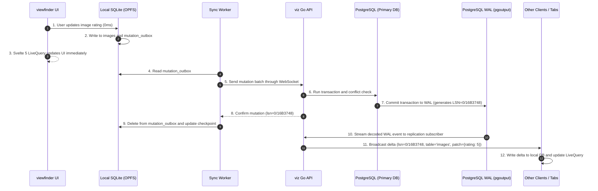

# Local-First Replicated Sync Engine Architecture

**Last Updated:** September 1, 2026

## Purpose

This document describes the architecture for the `viz` local-first synchronization engine (**VizSync**). It defines how the `viz` Go backend and the `viewfinder` SvelteKit frontend keep the same state. It also describes how the system operates when the network is online or offline.

## 1. Executive Summary and Vision

The goal is to change `viz` from a standard client-server system into a **replicated state engine**.

In this architecture:

1. **The Core Engine stores all metadata on the client and backend:** The client stores a complete, indexed local copy of all metadata (images, collections, tags, ratings, transforms, settings, users, and jobs).
2. **Zero-latency reactive user interface:** The system reads and writes data in the local embedded engine at high speed. Svelte 5 runes (`$state`, `$derived`) update the user interface immediately without network requests.
3. **Continuous offline and online operation:** The user can browse, search, tag, rate, and organize collections when offline. When the network connects, a bidirectional synchronization pipeline resolves changes without data loss.
4. **Layered media caching:** The system manages grid thumbnails, preview images, and BlurHash strings through a layered caching pipeline.



## 2. Existing Codebase

The current `viz` implementation shows the following technical baselines and limitations:

### 2.1 Backend Data and Persistence Layer

- **Relational entities (`internal/entities/generated.go`):**
    - Primary entities: `ImageAsset`, `Collection`, `CollectionImage`, `SettingDefault`, `SettingOverride`, `User`, `WorkerJob`, and `ImageTransform`.
    - All primary keys use string identifiers (`Uid`) created by `internal/uid`. This design supports client-side identifier generation.
    - Complex metadata is stored in JSONB columns (`Exif`, `ImageMetadata`, `ImagePaths`, `AllowedValues`, and `Scopes`).
- **Database operations (`internal/db/operations.go`):**
    - PostgreSQL 18 with connection pool limits (`MaxOpenConns`, `MaxIdleConns`, and `ConnMaxLifetime`).
    - GORM ORM without change-tracking, Change Data Capture (CDC), or replication triggers.
- **WebSocket broker (`internal/http/websocket.go`):**
    - Memory circular buffer history (`WSRecord` ring buffer of 512 items).
    - Broadcasts simple event strings: `"image-created"`, `"image-updated"`, `"image-deleted"`, and `"collection-created"`.
    - Endpoints: `/events` (WebSocket upgrade), `/events/since` (memory cursor), and `/events/broadcast`.
    - **Limitation:** The history is lost when the server restarts. The cursor is not stored in PostgreSQL. Event payloads do not contain causality data or field diffs.

### 2.2 Frontend State and Lifecycle Layer

- **SvelteKit load functions (`viewfinder/src/routes/(app)/photos/+page.ts`):**
    - Pages fetch data over HTTP GET using `sendVizAPIRequest(listImages({...}))`.
- **Global event invalidation (`viewfinder/src/lib/states/events.svelte.ts`):**
    - The WebSocket client receives events and calls `invalidateApp(DataKeys.Photos)`. This action runs `invalidateAll()` or `preloadData()`.
    - **Limitation:** This causes full-page network refetches for minor edits. It increases latency and removes optimistic user interface state.
- **Client storage (`viewfinder/src/lib/db/client.ts`):**
    - The client uses `idb` only for `preferences` and `settings`. It does not store images or collections offline.

### 2.3 System Deficiencies and Requirements

| Area                   | Current Implementation                        | Sync Engine Requirement                                            |
| :--------------------- | :-------------------------------------------- | :----------------------------------------------------------------- |
| **Offline capability** | None. Only cached `app.html` shows            | Full offline browse, search, and edit for metadata and thumbnails. |
| **Mutation latency**   | High. Network roundtrip and full page reload. | Zero milliseconds. Optimistic local write with background sync.    |
| **Conflict handling**  | Row-level last-write-wins (overwrites data).  | Column-level last-write-wins CRDT and set CRDTs.                   |
| **Media caching**      | Standard browser HTTP cache (temporary).      | Persistent OPFS or IndexedDB blob storage with Service Worker.     |
| **Multi-tab sync**     | Each browser tab opens a separate WebSocket.  | `SharedWorker` and `BroadcastChannel` with shared local database.  |

## 3. Replicated Core Engine Design

The synchronization engine uses a **Replicated State Machine** model with **Hybrid Logical Clocks (HLC)** and a **Log-Structured Delta Replication Protocol**.

### VizSync Data Classification

| Classification Tier                | Storage & Replication Model                                                    | Included Assets and Entities                                                                                                                                    |
| :--------------------------------- | :----------------------------------------------------------------------------- | :-------------------------------------------------------------------------------------------------------------------------------------------------------------- |
| **Tier 1: Metadata State**         | **Fully Replicated**<br>Stored in client SQLite-WASM and backend PostgreSQL.   | • `ImageAsset` and EXIF metadata<br>• `Collection` and collection links<br>• Tags, ratings, user settings, and tombstones                                       |
| **Tier 2: Binary Blobs and Media** | **Layered Progressive Cache**<br>Cached in browser OPFS / Cache Storage API.   | • Level 0: BlurHash string (in metadata)<br>• Level 1: 300px WebP grid thumbnails<br>• Level 2: 2048px preview images<br>• Level 3: RAW and JPEG original files |
| **Tier 3: Ephemeral Presence**     | **In-Memory Pub/Sub**<br>Sent over WebSocket channels; not stored in database. | • Active users and viewers<br>• Focus and selection sets<br>• Background worker telemetry                                                                       |

### 3.1 Layered Data Architecture

#### Layer 1: Structured Metadata State (Fully Replicated)

- The client database and the backend database store identical copies of all metadata records.
- The engine replicates records through transactional change sets (`ChangeSet`).
- The user interface queries local records with zero network delay.

#### Layer 2: Binary Blobs and Media Derivatives (Layered Progressive Cache)

Storage-limited devices cannot store all original media. The system uses a four-level cache:

1. **Level 0 (Inline metadata):** BlurHash string (32 bytes) stored in the metadata record. Shows immediately during grid layout.
2. **Level 1 (Grid thumbnails - 300px WebP):** Saved in browser OPFS (Origin Private File System) or Cache Storage for fast offline scrolling.
3. **Level 2 (High-resolution previews - 2048px WebP/AVIF):** Downloaded and saved in an LRU cache when the user opens the image view.
4. **Level 3 (Original RAW/JPEG files):** Stored on the server disk in the library directory. Fetched on demand when online.

#### Layer 3: Ephemeral Collaborative State (Not Persisted)

- The server broadcasts active users, live selections, and job progress through WebSocket channels. This data is not written to the database log.

## 4. Subsystems and Components

### 4.1 Schema Automation from OpenAPI (Candidate Approach — Subject to Final Review)

To prevent manual schema duplication without adding extra configuration files or bloating `api/openapi/openapi.yaml`, the proposed design extends the existing `tools/genentities` tool.

#### Code Generation Pipeline

When a developer runs `make generate-types`, `tools/genentities` parses canonical entities from `openapi.yaml`. It outputs both backend entities and frontend sync structures:

```
                             api/openapi/openapi.yaml
                                        │
                         ┌──────────────┴──────────────┐
                         ▼                             ▼
                  oapi-codegen & oazapfts       tools/genentities
                         │                             │
             ┌───────────┴───────────┐        ┌────────┴────────┐
             ▼                       ▼        ▼                 ▼
      Go Backend DTOs      TypeScript DTOs  Backend GORM     viewfinder
      (internal/dto)       (@viz/api)       Entities         Sync Tables
                                            (generated.go)   (schema.gen.ts)
```

#### Generated Sync Components

1. **Type-Safe Sync Models (`viewfinder/src/lib/sync/schema.gen.ts`):**
    - Combines `@viz/api` DTOs with sync fields (`hlc_timestamp`, `sync_version`, `is_pending_sync`, `deleted_at`).
2. **Client Database Definitions:**
    - Translates OpenAPI property types to SQLite and IndexedDB column types automatically.
3. **Automated Serializers:**
    - Creates mapping functions between network DTOs and local storage rows without manual JSON code.

### 4.2 Client-Side Embedded Storage Engine

The client storage engine uses **SQLite-WASM with Origin Private File System (OPFS)** in modern browsers. It uses **IndexedDB** when OPFS is not available.



#### 1-to-1 Entity Mirroring Model

Client storage directly mirrors backend entities with a 1-to-1 relationship. The client does not define separate table structures or custom column mappings.

```
    BACKEND (PostgreSQL / GORM)                     CLIENT (SQLite-WASM / OPFS)
   ┌────────────────────────────┐                  ┌────────────────────────────┐
   │ images                     │ ◄── 1:1 Mirror ──► │ images                     │
   │ collections                │ ◄── 1:1 Mirror ──► │ collections                │
   │ collection_images          │ ◄── 1:1 Mirror ──► │ collection_images          │
   │ setting_overrides          │ ◄── 1:1 Mirror ──► │ setting_overrides          │
   │ worker_jobs                │ ◄── 1:1 Mirror ──► │ worker_jobs                │
   └────────────────────────────┘                  └────────────────────────────┘
                 ▲                                               ▲
                 └─────────────── Both Derived From ─────────────┘
                             api/openapi/openapi.yaml
```

##### 1. Universal Sync Envelope

Every mirrored entity on the client uses a shared sync metadata envelope:

```typescript
// Shared sync envelope for all mirrored entities
export interface SyncEnvelope {
    hlc_timestamp: string;
    sync_version: number;
    is_pending_sync: boolean;
    deleted_at: string | null;
}

// Client types directly extend @viz/api models
export type Mirrored<T> = T & SyncEnvelope;

export type ImageAssetEntity = Mirrored<ImageAsset>;
export type CollectionEntity = Mirrored<Collection>;
export type CollectionImageEntity = Mirrored<CollectionImage>;
export type SettingOverrideEntity = Mirrored<SettingOverride>;
```

##### 2. Client System Tables

The client maintains only two generic system tables:

###### `mutation_outbox` (Pending Client Mutations)

| Field           | Type             | Description                                                                                 |
| :-------------- | :--------------- | :------------------------------------------------------------------------------------------ |
| `mutation_id`   | String (PK)      | Unique identifier for the local change.                                                     |
| `entity_table`  | String           | Name of the target table (`images`, `collections`, `setting_overrides`).                    |
| `row_identity`  | Key Tuple (JSON) | Primary key values of the record (`{"uid": "..."}` or `{"user_id": "...", "name": "..."}`). |
| `operation`     | Enum             | `INSERT`, `UPDATE`, or `DELETE`.                                                            |
| `patch_json`    | JSON Object      | Field-level modification delta.                                                             |
| `hlc_timestamp` | String           | Hybrid Logical Clock timestamp of the local edit.                                           |
| `retry_count`   | Integer          | Count of push attempts.                                                                     |

###### `sync_checkpoints` (Sequence Watermarks)

| Field             | Type        | Description                                                          |
| :---------------- | :---------- | :------------------------------------------------------------------- |
| `client_id`       | String (PK) | Unique client instance identifier.                                   |
| `last_server_lsn` | String      | Highest PostgreSQL Log Sequence Number (LSN) applied by this client. |
| `last_sync_hlc`   | String      | Most recent confirmed HLC timestamp.                                 |
| `last_synced_at`  | Timestamp   | Time of the last completed sync cycle.                               |

#### Reactive Svelte 5 Live Queries

The user interface subscribes directly to the local database:

```typescript
// viewfinder/src/lib/sync/live-query.svelte.ts
import { localEngine } from "$lib/sync/engine";

export function createLiveQuery<T>(sql: string, params: any[] = []) {
    let data = $state<T[]>([]);
    let loading = $state<boolean>(true);

    const refresh = async () => {
        data = await localEngine.query<T>(sql, params);
        loading = false;
    };

    $effect(() => {
        refresh();
        const unsubscribe = localEngine.onMutation(() => {
            refresh();
        });
        return () => {
            unsubscribe();
        };
    });

    return {
        get value() {
            return data;
        },
        get isLoading() {
            return loading;
        }
    };
}
```

### 4.3 Backend Sync Coordinator and Native PostgreSQL WAL (Logical Replication)

The backend uses native **PostgreSQL 18 Logical Replication (CDC)** to stream database changes directly from the Write-Ahead Log (WAL).

```
                  POSTGRESQL 18 ENGINE                         BACKEND SYNC SERVICE
        ┌──────────────────────────────────────┐             ┌──────────────────────┐
        │ Database Transactions (ACID)         │             │                      │
        │ • images                             │             │  PostgreSQL Logical  │
        │ • collections                        │  WAL Stream │  Replication Client  │
        │ • setting_overrides                  │────────────►│  (pglogrepl / pgx)   │
        │ • collection_images                  │  (pgoutput) │                      │
        │                                      │             └──────────┬───────────┘
        │ Native Write-Ahead Log (WAL)         │                        │
        │ Commit LSN (Log Sequence Number)     │                        ▼
        └──────────────────────────────────────┘             ┌──────────────────────┐
                                                             │ WebSocket Broadcast  │
                                                             │ to Connected Tabs    │
                                                             └──────────────────────┘
```

#### 1. Logical Replication Publication

The backend creates a PostgreSQL logical replication publication for all mirrored tables:

```sql
CREATE PUBLICATION viz_sync_publication FOR ALL TABLES;
```

#### 2. Native Row-Identity and Change Event Format

PostgreSQL `pgoutput` decodes WAL commits and produces structured change events:

| Field          | Type              | Description                                                                      |
| :------------- | :---------------- | :------------------------------------------------------------------------------- |
| `lsn`          | String            | Monotonically increasing Log Sequence Number (e.g., `0/16B3748`).                |
| `table`        | String            | Target database table name (`images`, `setting_overrides`, `collection_images`). |
| `action`       | Enum              | `INSERT`, `UPDATE`, or `DELETE`.                                                 |
| `row_identity` | Key Tuple (JSON)  | Primary key values. Supports single UIDs, composite keys, and natural keys.      |
| `patch`        | Column Map (JSON) | Modified columns with their new values.                                          |
| `committed_at` | Timestamp (UTC)   | Exact server transaction commit timestamp.                                       |

#### 3. Automatic Primary Key Handling

The WAL stream identifies modified rows by their native table keys:

- **Single UID (`images`):** `row_identity = { "uid": "img_01J8ABC45D67E89F" }`
- **Composite Key (`collection_images`):** `row_identity = { "collection_uid": "col_123", "image_uid": "img_456" }`
- **Composite Key (`setting_overrides`):** `row_identity = { "user_id": "usr_789", "name": "theme.mode" }`

#### 4. Server Pipeline Flow

1. When a transaction commits, PostgreSQL appends the modification to its WAL.
2. The Go backend replication subscriber (`internal/sync/subscriber.go`) receives the decoded WAL change event.
3. The server `WSBroker` broadcasts the change event to all connected WebSocket clients.
4. When a disconnected client reconnects, it calls `GET /sync/deltas?since_lsn=0/16B3748` to receive missed transactions.



## 5. Bidirectional Sync Protocol and Conflict Resolution

### 5.1 Hybrid Logical Clocks

Physical hardware clocks drift across client and server machines. The `viz` sync engine uses **Hybrid Logical Clocks (HLC)** to create a total order of all events.

#### Clock Structure

An HLC timestamp contains three components:

```
[ physical_time_ms ] : [ logical_counter ] : [ client_id ]
```

| Component          | Type             | Description                                                      |
| :----------------- | :--------------- | :--------------------------------------------------------------- |
| `physical_time_ms` | Integer (64-bit) | Milliseconds elapsed since the Unix epoch (UTC).                 |
| `logical_counter`  | Integer (32-bit) | Incremental counter to order events within the same millisecond. |
| `client_id`        | String           | Unique identifier of the originating client or server.           |

**Example:** `1740837600000:0001:usr_01J8ABC45D67E89F`

#### Clock Update Rules

The engine updates the clock state on two conditions:

1. **Local Event:**
    ```
    HLC_local = max(HLC_local.physical, PhysicalTime) + 1
    ```
2. **Received Remote Event:**
    ```
    HLC_local = max(HLC_local.physical, HLC_remote.physical, PhysicalTime) + 1
    ```

These rules guarantee causality and strict event ordering across all connected devices.

### 5.2 Conflict Resolution Rules

#### 1. Column-Level Last-Write-Wins

Full-row updates can overwrite unrelated attributes. The engine resolves conflicts at the column level:

- **Scenario:**
    - Client A updates `name` to `"Sunset in Tokyo"` at timestamp `HLC_1`.
    - Client B (offline) updates `rating` to `5` and `favourited` to `true` at timestamp `HLC_2`.
- **Resolution:**
    - The engine compares HLC timestamps for each column independently.
- **Result:**
    - `name = "Sunset in Tokyo"`, `rating = 5`, and `favourited = true`.

#### 2. Observed-Remove Set for Collections and Tags

The engine uses an Observed-Remove Set (OR-Set) for relationship tables:

- **Scenario 1:** Client A adds an image to a collection offline. Client B adds a different image to the same collection online.
    - **Result:** Both images remain in the collection.
- **Scenario 2:** Client A removes an image from a collection. Client B adds a tag to the same image.
    - **Result:** The image is removed from the collection and the tag is added.

#### 3. Soft-Delete Tombstones and Garbage Collection

- When a user deletes a record, the engine writes a `deleted_at` timestamp with an HLC tombstone.
- The engine replicates tombstones to all clients to prevent old data from reappearing.
- The system permanently purges records after the 30-day retention period defined in `viz` Trash (`internal/jobs/trash.go`).

## 6. Media Derivative Caching

The application uses a progressive caching pipeline to load image assets instantly. Components such as [`ImageLightbox.svelte`](viewfinder/src/lib/components/ui/ImageLightbox.svelte) and [`AssetImage.svelte`](viewfinder/src/lib/components/ui/AssetImage.svelte) use this pipeline.

### 6.1 Progressive Loading in `ImageLightbox` and `AssetImage`

When a component renders an `ImageAsset` record:

```bash
┌────────────────────────────────────────────────────────────────────────┐
│               AssetImage or ImageLightbox Requests Image               │
└──────────────────────────────────┬─────────────────────────────────────┘
                                   │
                   1. Read inline metadata blurhash
                                   │
                         ┌─────────┴─────────┐
                        Yes                  No
                         │                   │
               Render Instant Blur           Render Solid Color
               via getThumbhashURL()         Placeholder
               (0ms latency)                 (0ms latency)
                         │                   │
                         └─────────┬─────────┘
                                   │
                   2. Check Service Worker Cache API or OPFS
                      for /images/{uid}/file?width=400 (Thumbnail)
                                   │
                         ┌─────────┴─────────┐
                       Found             Not Found
                         │                   │
               Display Thumbnail          Online?
               in ImageLoader (0ms)          │
                         │             ┌─────┴─────┐
                         │            Yes          No
                         │             │           │
                         │      Fetch from API     Show Offline
                         │      and cache locally  Warning Icon
                         │             │
                         └─────────────┤
                                       ▼
                   3. If in ImageLightbox (resolution="preview"):
                      Request /images/{uid}/file?width=1920 (Preview)
                                       │
                             ┌─────────┴─────────┐
                           Cached             Online?
                             │                   │
                      Upgrade Display      ┌─────┴─────┐
                      to 1920px Preview   Yes          No
                                           │           │
                                    Stream and cache   Retain
                                    1920px WebP        Thumbnail View
```

### 6.2 Component Integration Details

#### 1. ThumbHash and BlurHash Placeholder

- The local SQLite `images` table stores the `blurhash` string in the metadata record.
- `AssetImage.svelte` calls `getThumbhashURL()` from `viewfinder/src/lib/utils/images.ts`.
- This function creates an in-memory Data URI.
- The browser shows the blur placeholder in zero milliseconds without a network request.

#### 2. Thumbnail Cache Interception

- `AssetImage.svelte` requests the thumbnail URL from `getAssetImagePath(asset, 'thumbnail')`.
- This helper builds the endpoint `/images/{uid}/file?format=webp&width=400`.
- The browser Service Worker (`viewfinder/src/service-worker.ts`) intercepts the HTTP request.
- If the thumbnail exists in `Cache Storage` or OPFS, the worker returns the cached WebP blob.
- When the device is online, the worker downloads the image from `cmd/api/routes/images.go` and updates the local cache.

#### 3. Lightbox Preview Transition

- When the user opens `ImageLightbox.svelte`, the component requests the 1920px preview.
- `ImageLightbox.svelte` configures `AssetImage.svelte` with `placeholder='thumbnail'`.
- The cached 400px thumbnail displays immediately.
- This prevents layout shift and avoids loading spinners.
- [`ImageLoader`](viewfinder/src/lib/images/loader/image-loader.svelte.ts) loads the 1920px WebP image in the background.
- When the download finishes, [`ImageLoader`](viewfinder/src/lib/images/loader/image-loader.svelte.ts) transitions cleanly to the high-resolution image.
- If the device is offline and the preview is not in cache, the lightbox keeps the thumbnail view.

## 7. Multi-Tab Coordination and Resource Efficiency

1. **`SharedWorker` Singleton:**
    - All browser tabs connect to one background `SharedWorker`.
    - The `SharedWorker` holds the single WebSocket connection to the `viz` backend.
    - It sends incoming deltas to all open tabs through `MessagePort`.
2. **Web Locks API (`navigator.locks`):**
    - Makes sure only one tab writes to SQLite OPFS at a time.
3. **Delta Compression:**
    - WebSocket and HTTP delta payloads use compact JSON or MessagePack with gzip or `zstd` compression.
4. **Local Database Compaction:**
    - The client SQLite database executes `PRAGMA incremental_vacuum` periodically to clean unused storage space.

## 8. Performance and Scaling Architecture

### 8.1 Data Access Characteristics

| Dimension                        | Current Network Model                                 | Local-First Replicated Model                                               |
| :------------------------------- | :---------------------------------------------------- | :------------------------------------------------------------------------- |
| **Metadata Reads**               | Network-bound HTTP request with roundtrip latency.    | Local in-memory or OPFS B-Tree index scan with zero network dependency.    |
| **Search and Filtering**         | Remote database query over network connection.        | Local SQL query with indexed columns.                                      |
| **User Interface Mutations**     | Blocking server request before user interface update. | Immediate optimistic local state update with asynchronous background push. |
| **Network Payload per Mutation** | Full entity list refetch through route invalidation.  | Targeted column-level delta containing only modified fields.               |
| **Offline Operation**            | Unavailable (network requests fail).                  | Fully functional for reads, searches, and edits.                           |

### 8.2 Resource and Storage Management

- **Storage Efficiency:**
    - Replicated metadata stores structured text and numerical attributes locally.
    - Large binary assets (RAW originals and high-resolution previews) remain tiered on the server and load on demand.
    - The local database runs `PRAGMA incremental_vacuum` to reclaim disk space after record deletions.
- **Memory Management:**
    - The Svelte 5 user interface renders only the visible viewport through virtualized lists, keeping DOM memory low.
    - The SQLite-WASM runtime operates inside a bounded WebAssembly memory heap.
- **Bandwidth Optimization:**
    - Real-time synchronization sends only modified fields in delta payloads instead of full entity snapshots.
    - When reconnecting after being offline, the client requests changes from its saved sequence watermark (`GET /sync/deltas?since_lsn=<lsn>`), preventing redundant data transfer.

## 9. Implementation Tasks

### Client Storage and Reactivity (`viewfinder`)

- Embed `@sqlite.org/sqlite-wasm` with OPFS support in `viewfinder/src/lib/sync/`.
- Generate local SQLite tables that mirror backend GORM entity models (`images`, `collections`, `setting_overrides`).
- Add the `mutation_outbox` and `sync_checkpoints` system tables.
- Implement `createLiveQuery(sql, params)` with Svelte 5 runes (`$state`, `$effect`).
- Replace REST calls in `viewfinder` view states (`photos`, `collections`, `search`) with live queries.
- Connect local optimistic user mutations to the `mutation_outbox`.

### PostgreSQL Logical Replication and Change Data Capture

- Configure the PostgreSQL logical replication publication (`CREATE PUBLICATION viz_sync_publication FOR ALL TABLES`).
- Implement the Go WAL replication subscriber in `internal/sync/subscriber.go` using `pglogrepl` and `pgx`.
- Stream decoded change events from `pgoutput` to `WSBroker` in `internal/http/websocket.go`.
- Add `POST /sync/push` in `cmd/api/routes/sync.go` for client outbox ingestion.
- Add `GET /sync/deltas?since_lsn=<lsn>` for client catch-up streams.

### Conflict Resolution and Causality

- Implement Hybrid Logical Clock (HLC) generation and tracking in Go and TypeScript.
- Implement column-level Last-Write-Wins (LWW) attribute merging.
- Implement Observed-Remove Set (OR-Set) rules for collections and tags.
- Replicate soft-delete tombstones across devices.

### Media Caching and Multi-Tab Coordination

- Configure the Service Worker (`viewfinder/src/service-worker.ts`) to intercept thumbnail requests (`/images/{uid}/file?format=webp&width=400`).
- Store downloaded 300px WebP thumbnails in browser `Cache Storage` or OPFS.
- Connect thumbnail cache fallbacks to `AssetImage.svelte` and `ImageLightbox.svelte`.
- Implement a `SharedWorker` in `viewfinder` to coordinate a single WebSocket connection across open browser tabs.
- Protect SQLite OPFS write operations with the Web Locks API (`navigator.locks`).

## 10. Verification, Testing, and Failure Scenarios

| Failure Condition                             | Preventive Action                                                                                                  | Verification Method                                                                           |
| :-------------------------------------------- | :----------------------------------------------------------------------------------------------------------------- | :-------------------------------------------------------------------------------------------- |
| **Server stops during mutation batch**        | Client outbox keeps records until server confirms with `lsn`. Client resends on reconnect.                         | Stop `viz` server process during active batch and verify data safety.                         |
| **Simultaneous offline edits on two devices** | Column-level LWW with HLC merges disjoint columns. Set CRDT preserves collection items.                            | Disconnect two clients, perform conflicting edits, reconnect, and verify matching final data. |
| **Network interruption during sync catch-up** | Client sync worker resumes delta stream using last applied sequence watermark (`last_server_lsn`).                 | Interrupt network during catch-up and verify resume from exact checkpoint.                    |
| **Browser storage limit reached**             | Tiered eviction: delete Level 2 previews first, then Level 1 thumbnails. Keep Level 0 metadata and outbox records. | Simulate storage limit in browser developer tools and verify metadata remains intact.         |

## 11. Future Considerations

### Offline Upload Staging Pipeline

Offline media upload adds substantial complexity (local chunk storage, client-side EXIF parsing, quota management, and resumable transfer protocols). This can be implemented in a future iteration after the core synchronization engine is stable.

#### Conceptual Workflow

1. **Client-side staging:**
    - The client stores binary files in OPFS under `pending_blobs/{uid}.bin`.
    - The client creates a 300px WebP thumbnail with HTML Canvas or WebAssembly libvips.
    - The client inserts the `ImageAsset` row into local storage with `is_pending_sync = 1` and `processed = 0`.
2. **Immediate user interface display:**
    - The photos appear in the grid and albums with a "Pending Sync" badge.
    - The user can favorite, tag, describe, and organize photos before they upload.
3. **Background upload synchronization:**
    - When network connectivity returns, the background worker uploads binary files using resumable chunk requests.
    - The server processes permanent transforms with `Watermill` (`internal/jobs/queue.go`) and confirms completion.
    - The client removes the temporary file `pending_blobs/{uid}.bin`.
