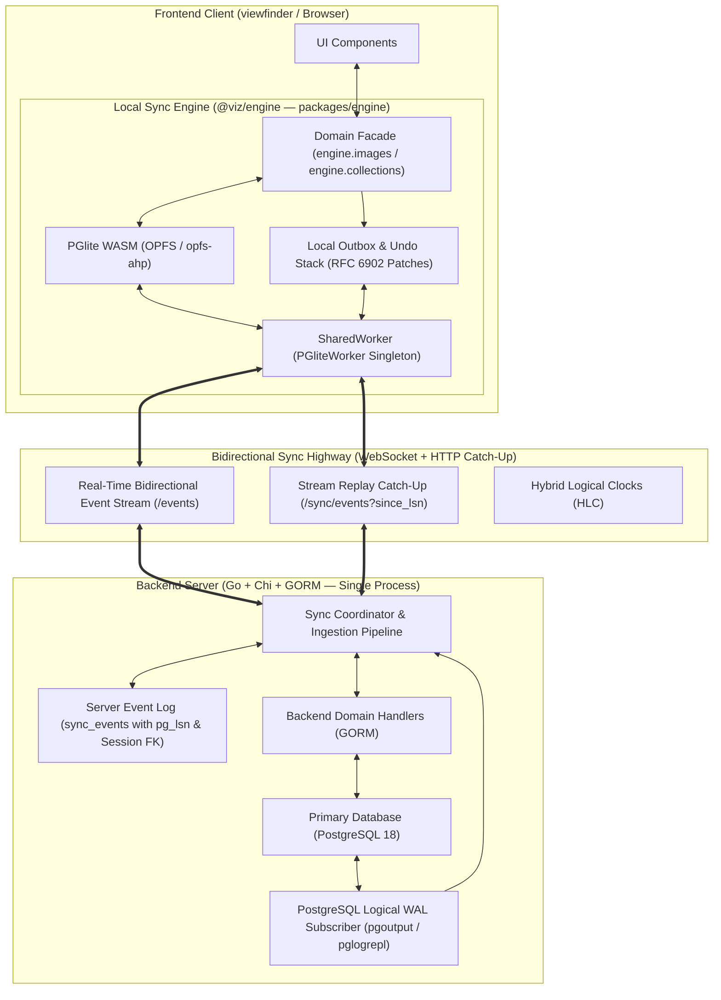

# VizSync Engine Architecture

**Last Updated:** September 8, 2026

## Purpose

This document defines the architecture for the `viz` synchronization engine (**VizSync**). It specifies how the `viz` Go backend and the `viewfinder` SvelteKit frontend keep state in sync across online and offline states.

## 1. Summary and Vision

VizSync changes `viz` from a standard client-server system into an **event-driven replicated state machine**. The system provides full **Postgres-to-Postgres parity**.

### Core Architecture Pillars

1. **Postgres-to-Postgres Parity:**
    - The backend runs PostgreSQL 18 with native Write-Ahead Log (WAL) logical replication.
    - The frontend runs PGlite (WebAssembly PostgreSQL) managed by the `@viz/engine` package.
    - Both environments share identical relational schemas, column data types, constraints, and JSONB operations.
2. **Clean Domain Schemas:**
    - Business tables (`images`, `collections`, `users`) contain domain data only.
    - Business tables contain no synchronization columns.
    - All synchronization data lives in a single event log table (`sync_events`).
3. **Decoupled System Layers:**
    - The user interface writes no SQL and no ORM queries.
    - The frontend user interface calls a JavaScript domain API (`engine.images.update()`, `engine.images.query()`).
    - Svelte 5 runes (`$state`, `$derived`) react to local database state with zero delay.
    - Backend route handlers process clean data transfer objects using GORM.
    - The sync engine coordinates data replication in the background.
4. **Single Event Log with RFC 6902 JSON Patches:**
    - The system records every change as an atomic event in an append-only log.
    - Target entities are embedded in the patch path (such as `/images/img_123/name`).
    - Mutations use RFC 6902 JSON Patches with forward and inverse diffs.
    - The inverse patch enables local undo, redo, event replay, and optimistic rebasing.
    - The event log links directly to the user session and PostgreSQL native `pg_lsn`.
5. **In-Process Go Backend:**
    - The sync coordinator runs inside the single `viz` Go process.
    - It requires no external daemons and no Docker containers during local development.
    - A background Go goroutine reads PostgreSQL commits using `pglogrepl`.
6. **SharedWorker Transport:**
    - A SharedWorker manages one local PGlite database instance and one persistent WebSocket connection.
    - All open browser tabs communicate through this worker.
    - The server streams committed database events to clients.
    - The client pushes uncommitted local events to the server.
    - Ephemeral collaborative data travels out of band.



## 2. Existing Baseline and Limitations

The current `viz` implementation shows the following technical baselines and limitations:

### 2.1 Backend Data and Persistence Layer

- **Relational entities ([internal/entities/generated.go](../../internal/entities/generated.go)):**
    - Primary entities: `ImageAsset`, `Collection`, `CollectionImage`, `SettingDefault`, `SettingOverride`, `User`, `WorkerJob`, and `ImageTransform`.
    - Primary keys use string identifiers (`Uid`) generated by [internal/uid](../../internal/uid).
    - Metadata lives in JSONB columns (`Exif`, `ImageMetadata`, `ImagePaths`, `AllowedValues`, `Scopes`).
- **Database operations ([internal/db/operations.go](../../internal/db/operations.go)):**
    - PostgreSQL 18 accessed through GORM without change tracking or replication triggers.
- **WebSocket broker ([internal/http/websocket.go](../../internal/http/websocket.go)):**
    - Uses an in-memory ring buffer of 512 items.
    - Broadcasts simple string events: `"image-created"`, `"image-updated"`, `"image-deleted"`.
    - Server restarts clear the buffer history.
    - Event payloads do not contain causal metadata or field diffs.
    - Clients must refetch full datasets when they receive events.

### 2.2 Frontend State and Lifecycle Layer

- **SvelteKit load functions ([viewfinder/src/routes/(app)/photos/+page.ts](../../viewfinder/src/routes/(app)/photos/+page.ts)):**
    - Fetches data over HTTP GET using `sendVizAPIRequest(listImages({...}))`.
- **Global event invalidation ([viewfinder/src/lib/states/events.svelte.ts](../../viewfinder/src/lib/states/events.svelte.ts)):**
    - Receives WebSocket events and executes `invalidateApp(DataKeys.Photos)` or `invalidateAll()`.
    - Causes full-page network refetches for small edits.
    - Increases latency and removes optimistic user interface state.
- **Client storage ([viewfinder/src/lib/db/client.ts](../../viewfinder/src/lib/db/client.ts)):**
    - Uses `idb` only for user preferences.
    - Does not store images or collections offline.

## 3. Data Classification and Schema Architecture

### 3.1 Data Classification

The sync engine distinguishes between persistent database records and transient pub/sub messages:

| Classification                | Storage and Replication Model                                                        | Included Entities and Data                                                                                       |
| :---------------------------- | :----------------------------------------------------------------------------------- | :--------------------------------------------------------------------------------------------------------------- |
| **Replicated Database State** | **Event-Sourced Replicated Model**<br>Client PGlite (WASM) and Server PostgreSQL 18. | • Domain tables: `images`, `collections`, `collection_images`, `setting_overrides`<br>• Log: `sync_events`       |
| **Ephemeral Presence**        | **In-Memory Pub/Sub**<br>Sent over WebSocket channels. Bypasses the database log.    | • Active users and viewers<br>• Selection and focus sets<br>• Background worker telemetry (`WorkerJob` progress) |

### 3.2 Clean Domain Models vs. Single Sync Event Log

Domain models maintain clean Go structs matching [openapi.yaml](../../api/openapi/openapi.yaml). The synchronization engine maintains its own single event log table. All models register with GORM `AutoMigrate` on startup.

#### A. Pure Domain GORM Models ([internal/entities/generated.go](../../internal/entities/generated.go))

Domain models contain business fields only. They contain no synchronization primitives:

#### B. The Single Sync Event Log Model (`sync_events`)

The backend sync engine defines one event log table. It ties directly to the user session and the PostgreSQL WAL:

```go
package sync

import (
    "time"
    "viz/internal/entities"
)

type SyncEvent struct {
    ID             string            `gorm:"primaryKey" json:"id"`
    SessionUID     string            `gorm:"not null;index" json:"session_uid"`
    Session        *entities.Session `gorm:"foreignKey:SessionUID;references:Uid" json:"-"`

    Patch          string            `gorm:"type:jsonb;not null" json:"patch"`
    Inverse        string            `gorm:"type:jsonb;not null" json:"inverse"`
    HLC            string            `gorm:"not null;index" json:"hlc"`
    ServerLSN      string            `gorm:"type:pg_lsn;not null;index" json:"server_lsn"`
    Status         SyncStatus        `gorm:"not null;index" json:"status"` // APPLIED, SUPERSEDED, REJECTED
    WinningEventID *string           `json:"winning_event_id,omitempty"`
    CreatedAt      time.Time         `gorm:"not null;index" json:"created_at"`
}
```

Registered with GORM `AutoMigrate` inside [`internal/entities/models.go`](../../internal/entities/models.go):

```go
func Models() []any {
    return []any{
        ImageAsset{},
        Collection{},
        CollectionImage{},
        Session{},
        SyncEvent{}, // Single event log table
    }
}
```

## 4. RFC 6902 Event Specification and Patch Engine

### 4.1 Event Structure

The system models every mutation as a self-contained event. The patch path identifies the target entity:

```typescript
export interface SyncEvent {
    id: string;
    session_uid: string;
    patch: Operation[]; // RFC 6902 forward patch
    inverse: Operation[]; // RFC 6902 inverse patch for undo
    hlc: string; // Hybrid Logical Clock
    server_lsn?: string; // PostgreSQL WAL position
    status: "PENDING" | "APPLIED" | "SUPERSEDED";
    winning_event_id?: string;
    created_at: string;
}
```

### 4.2 Automatic Patch Generation

Developers never write JSON pointer strings by hand. The frontend sync client generates forward and inverse patches when a domain method executes:

```typescript
import { compare } from "fast-json-patch";

export function createMutationEvent<T extends { uid: string }>(
    entityPath: string,
    currentEntity: T,
    partialUpdate: Partial<T>
): SyncEvent {
    const nextEntity = structuredClone(currentEntity);
    deepMerge(nextEntity, partialUpdate);

    // Forward patch: [{ op: "replace", path: "/images/img_123/exif/artist", value: "Jane" }]
    const forwardPatch = compare(currentEntity, nextEntity);

    // Inverse patch: [{ op: "replace", path: "/images/img_123/exif/artist", value: "Old Artist" }]
    const inversePatch = compare(nextEntity, currentEntity);

    return {
        id: generateUID(),
        session_uid: currentSession.uid,
        patch: forwardPatch,
        inverse: inversePatch,
        hlc: hlcClock.now(),
        status: "PENDING",
        created_at: new Date().toISOString()
    };
}
```

### 4.3 Relational Actions as Discrete Operations

The system does not record relational associations as array modifications inside a parent JSON document. Instead, associations use independent row events on `collection_images`:

- **Add image to collection:** `action: "INSERT", path: "/collection_images/col_1:img_2"`
- **Remove image from collection:** `action: "DELETE", path: "/collection_images/col_1:img_2"`

Independent row operations prevent concurrent user modifications from overwriting the collection membership.

## 5. Subsystem Architecture

### 5.1 Frontend Subsystem (viewfinder & @viz/engine)

The frontend separates user interface view logic from storage and replication mechanics. The local database, outbox, and reactive queries live in `@viz/engine` (`packages/engine`).

`@viz/engine` declares `@viz/api` (`packages/api`) as an internal workspace dependency (`"workspace:*"`). It relies on `@viz/api` for:

- Generated TypeScript DTO interfaces (`ImageAsset`, `Collection`, `User`, `Setting`, `SyncEvent`).
- HTTP catch-up requests (`GET /sync/events?since_lsn=...`).
- HTTP outbox ingestion requests (`POST /sync/push`).
- Base client configuration, base URL, and session authentication credentials.

`viewfinder` consumes `@viz/engine` for local reactive queries and mutations. `viewfinder` continues to use `@viz/api` directly for non-synchronized RPC operations (such as authentication).

```
[ Svelte 5 UI Components ]
      │ Calls domain methods (e.g. engine.images.update)
      ▼
[ Frontend Domain Facade (@viz/engine) ]
      │ Generates RFC 6902 forward and inverse patches
      ▼
[ Local Outbox & Projection ]  ◄── (Undo / Redo / Rebase)
      │ Applies patches to local PGlite optimistically
      ▼
[ SharedWorker Client (PGliteWorker) ]
      │ Multiplexes single WebSocket connection across tabs
      ▼
[ Network Highway to Backend ]
```

#### A. Universal Load Functions and Domain User Interface

Per project guidelines, route data queries execute inside client-side `+page.ts` universal load functions. Components receive reactive state via `$props()`.

In photo route loaders ([viewfinder/src/routes/(app)/photos/+page.ts](../../viewfinder/src/routes/(app)/photos/+page.ts)):

```typescript
import { engine } from "@viz/engine";
import { photosSort } from "$lib/states/sort.svelte";
import type { PageLoad } from "./$types";

export const load: PageLoad = async () => {
    const photos = engine.images.query({
        sortBy: photosSort.value.by,
        order: photosSort.value.order,
        limit: 100
    });

    return {
        photos
    };
};
```

In grid view components ([viewfinder/src/routes/(app)/photos/+page.svelte](../../viewfinder/src/routes/(app)/photos/+page.svelte)):

```svelte
<script lang="ts">
    import ImageCard from "$lib/components/ui/ImageCard.svelte";
    import type { PageProps } from "./$types";

    let { data }: PageProps = $props();
</script>

{#each data.photos.data as photo (photo.uid)}
    <ImageCard asset={photo} />
{/each}
```

In metadata editor components ([viewfinder/src/lib/components/ui/panels/MetadataPanel.svelte](../../viewfinder/src/lib/components/ui/panels/MetadataPanel.svelte)):

```svelte
<script lang="ts">
    import { engine } from "@viz/engine";
    import StarRating from "$lib/components/image-tools/StarRating.svelte";

    let { asset }: Props = $props();
    let starRating = $derived<number | null>(asset?.image_metadata?.rating ?? null);

    async function setImageRating(newRating: number | null) {
        if (!asset) {
            return;
        }

        await engine.images.update(asset.uid, {
            image_metadata: { rating: newRating }
        });
    }
</script>

<StarRating value={starRating} onChange={setImageRating} />
```

#### B. Instant Undo and Redo

Every local event stores an inverse patch. The engine provides universal undo and redo operations:

```typescript
export async function undo() {
    const lastEvent = outbox.popRecentLocalEvent();
    if (!lastEvent) {
        return;
    }

    await applyPatchToPGlite(lastEvent.inverse);
    syncTransport.pushEvent(createInvertedEvent(lastEvent));
}
```

#### C. Multi-Tab Coordination

A singleton SharedWorker hosts the PGlite instance and the single WebSocket connection:

- All open browser tabs communicate with this worker through a `MessagePort`.
- An edit in Tab 1 updates PGlite in the worker.
- The worker broadcasts the patch to all connected tabs with zero network roundtrips.

#### D. Storage Engine and WASM Resource Budget

The local database uses PGlite backed by the Origin Private System (`opfs-ahp://`):

- **Low-Latency Storage:** Synchronous Access Handles in OPFS avoid IndexedDB transaction flush delays.
- **Worker Isolation:** PGlite runs exclusively inside the `SharedWorker`. The main user interface thread performs no WebAssembly compilation and allocates no linear memory.
- **WASM Asset Coexistence:** `viewfinder` hosts three WebAssembly modules (`libexif-wasm`, `wasm-vips`, and `pglite.wasm`). The application loads each module lazily in dedicated worker contexts.
- **Bytecode Caching:** Browsers cache compiled WebAssembly bytecode across sessions. Subsequent visits bypass compilation delays.

### 5.2 Backend Subsystem (`viz` Go API & PostgreSQL 18)

The backend handles business logic through standard GORM entities. PostgreSQL native WAL handles event capture. Everything runs in-process inside the `viz` binary.

#### A. Pure Domain Handlers

Route handlers in [cmd/api/routes/images.go](../../cmd/api/routes/images.go) process standard data transfer objects using GORM:

```go
func (h *ImageHandler) UpdateImage(w http.ResponseWriter, r *http.Request) {
    var update dto.ImageUpdate
    if err := render.DecodeJSON(r.Body, &update); err != nil {
        render.Error(w, err)
        return
    }

    updatedImage, err := h.imageService.Update(r.Context(), uid, update)
    if err != nil {
        render.Error(w, err)
        return
    }

    render.JSON(w, http.StatusOK, updatedImage)
}
```

#### B. PostgreSQL Native Logical Replication

1. PostgreSQL defines a replication publication:
    ```sql
    CREATE PUBLICATION viz_sync_publication FOR ALL TABLES;
    ```
2. The Go WAL subscriber ([internal/sync/subscriber.go](../../internal/sync/subscriber.go)) connects through `pglogrepl` and `pgx` using the `pgoutput` plugin.
3. Every committed transaction generates commit events containing the server LSN, table relation, and column patches.
4. The Go sync service ingests the WAL event, records it in `sync_events`, and streams the event to clients through the WebSocket broker ([internal/http/websocket.go](../../internal/http/websocket.go)).

## 6. Bidirectional Sync Protocol and Transport

### 6.1 WebSocket Real-Time Highway

The WebSocket connection (`/events`) in the client SharedWorker handles three data flows:

1. **Downstream WAL Stream (Server to Client):**
    - Transmits committed PostgreSQL change events containing `{ server_lsn, patch }`.
    - The client applies patches to PGlite and updates active Svelte live queries immediately.
2. **Upstream Fast-Path Push (Client to Server):**
    - When online, the client pushes uncommitted `SyncEvent` payloads directly over the WebSocket.
    - The server validates and commits the mutation in a database transaction.
    - The server returns an acknowledgment with the assigned `server_lsn`.
3. **Ephemeral Collaborative Presence (Tier 3 Data):**
    - User focus, active selections, and background worker progress ([WorkerJob](../../internal/entities/generated.go)) stream out of band without database logging.

### 6.2 Stream Replay Catch-Up (No Checkpoint Table)

- The client stores its own applied LSN locally in PGlite (`SELECT MAX(server_lsn) FROM _sync_events`).
- When reconnecting, `@viz/engine` calls `GET /sync/events?since_lsn=<lsn>` through `@viz/api`.
- The Go backend queries `sync_events WHERE server_lsn > ? ORDER BY server_lsn ASC`.
- The client replays missing events directly into PGlite. No server-side checkpoint table is needed.

## 7. Reconciliation, Rebasing, and Conflict Resolution

### 7.1 Hybrid Logical Clocks

Physical clocks drift across devices. VizSync uses Hybrid Logical Clocks (HLC) with the structure:

```
[ physical_time_ms ] : [ logical_counter ] : [ client_id ]
```

- Provides causal ordering across distributed nodes.
- Preserves causality across offline edits and network reconnections.

### 7.2 Optimistic Reconciliation

When a client makes offline edits while the server accepts remote transactions, the client reconciles state:

```
Local uncommitted events: [Event A] ──► [Event B]
Incoming server commit:   [Server Event X]

Rebase Sequence:
1. Unwind: Roll back Event B then Event A using their inverse patches.
2. Apply:  Apply authoritative Server Event X to local PGlite.
3. Rebase: Reapply Event A then Event B on top of the new base state.
4. Commit: Mark events as confirmed once acknowledged with server_lsn.
```

### 7.3 Conflict Resolution and Winner Tracking

- **Field-Level Last-Write-Wins:** RFC 6902 path granularity allows edits to disjoint paths (such as `/exif/artist` and `/image_metadata/rating`) to merge without conflict.
- **Colliding Paths:** If two clients edit the exact same path concurrently, the server stores both events in `sync_events`.
    - The higher HLC event receives `status: "APPLIED"`.
    - The lower HLC event receives `status: "SUPERSEDED"` and sets `winning_event_id`.
- **Relational Add-Wins:** Adding an image to a collection always wins over a concurrent removal.
- **Soft-Delete Tombstones:** Record deletions assign a timestamp to `deleted_at` on the entity. Records purge permanently after a retention window defined in either in the Trash ([internal/jobs/trash.go](../../internal/jobs/trash.go)) or Config ([internal/config/config.go](../../internal/config/config.go)).

## 8. System Implementation Tracks

The system organizes work into concurrent functional tracks:

### Data and Event Contract

- Maintain pure domain schemas from [openapi.yaml](../../api/openapi/openapi.yaml).
- Define the single `SyncEvent` GORM model in `internal/entities/sync.go`.
- Link `SyncEvent` to `Session` via foreign key `SessionUID`.
- Implement RFC 6902 event generation with forward and inverse operations.

### Frontend Engine (`@viz/engine` in `packages/engine`)

- Establish `packages/engine` as a dedicated workspace package depending on `@viz/api`.
- Connect `@viz/engine` to `@viz/api` for HTTP catch-up requests (`GET /sync/events`) and outbox push (`POST /sync/push`).
- Embed PGlite in a SharedWorker (`PGliteWorker`) backed by OPFS (`opfs-ahp://`).
- Build the `engine.images` and `engine.collections` domain facade with Svelte 5 query subscriptions.
- Implement automatic RFC 6902 forward and inverse patch generation using `fast-json-patch`.
- Implement client-side `engine.undo()` and `engine.redo()` stacks.
- Implement the optimistic reconciliation and rebasing state machine.

### Backend Engine (`viz` Go API)

- Configure the PostgreSQL 18 logical replication publication (`viz_sync_publication`).
- Implement the Go WAL subscriber using `pglogrepl` and `pgx` in [internal/sync/subscriber.go](../../internal/sync/subscriber.go).
- Connect the WAL subscriber to the WebSocket broker in [internal/http/websocket.go](../../internal/http/websocket.go).
- Implement `POST /sync/push` for outbox ingestion and `GET /sync/events` for LSN catch-up.

### Protocol and Transport

- Maintain one persistent WebSocket connection per client in the SharedWorker.
- Implement Hybrid Logical Clock causality trackers in TypeScript and Go.
- Stream out-of-band ephemeral messages for worker job telemetry and user presence.

## 9. Verification, Testing, and Failure Scenarios

| Failure Condition                                   | Preventive Architecture                                                                                                           | Verification Method                                                                                                                        |
| :-------------------------------------------------- | :-------------------------------------------------------------------------------------------------------------------------------- | :----------------------------------------------------------------------------------------------------------------------------------------- |
| **Server process restarts during mutation batch**   | Client retains uncommitted events in `_sync_outbox` until the server confirms with `server_lsn`. The client retries on reconnect. | Terminate the `viz` API process mid-transaction. Confirm zero data loss when the process restarts.                                         |
| **Conflicting concurrent edits on disjoint fields** | RFC 6902 path granularity allows edits to `/exif/artist` and `/image_metadata/rating` to merge without conflict.                  | Execute simultaneous offline edits across two clients. Reconnect and verify a clean merge.                                                 |
| **Conflicting concurrent edits on the same field**  | Deterministic HLC comparison marks the higher clock as `APPLIED` and the lower clock as `SUPERSEDED`.                             | Mutate the identical field on two disconnected clients. Verify that the winner is applied and the superseded event records the winning ID. |
| **Network drops during delta catch-up**             | The client resumes delta streaming from its last confirmed `server_lsn` stored in PGlite.                                         | Interrupt the network connection during catch-up. Verify that streaming resumes from the exact checkpoint without duplicates.              |
| **Browser storage quota reached**                   | Compact local PGlite database and prune old applied events from the local event log while retaining uncommitted outbox events.    | Simulate storage exhaustion in browser devtools. Verify event log and database integrity.                                                  |
