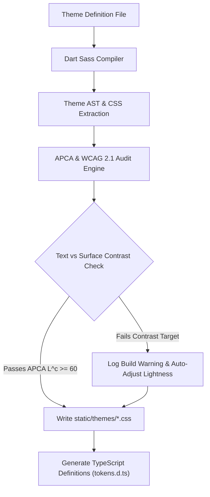

# Viz Design System 2.0 & Generative Theme Engine Plan

**Last Updated:** July 27, 2026

## Overview

This specification outlines the architecture, token schema, and implementation plan for **Viz Design System 2.0 (DS 2.0)**.

The primary goal of DS 2.0 is to evolve from a monochrome, single-accent preprocessor model to a **perceptually uniform, multi-role generative theme engine**. It introduces explicit surface elevations, OKLCH colour calculations, multi-colour brand accents, smooth runtime transitions, and **automated WCAG contrast auditing** at build time.

---

## 1. Motivation & Limitations of DS 1.0

| Feature | DS 1.0 (Legacy) | DS 2.0 (Current) |
| :--- | :--- | :--- |
| **Colour Space** | Legacy HSL (`color.change($color, $lightness)`) | **OKLCH** via `viz-engine.scss` ✓ |
| **Light Mode Strategy** | Mathematical inversion (`100% - lightness`) | **Purpose-crafted light & dark schemas** via `register-theme-core` ✓ |
| **Surface Tokens** | Generic numeric steps (`--viz-100` to `--viz-5`) | **Semantic elevations** (`surface-base`, `surface-panel`, `surface-card`, `surface-hover`, `surface-popover`, `surface-input`) ✓ |
| **Brand Accents** | Single primary accent (`--viz-primary`) | **Multi-role accents** (`primary`, `secondary`, `accent`) ✓ |
| **Accessibility Audit** | Manual developer inspection | **Automated build-time WCAG 2.1 audit** in `build-themes.js` ✓ |
| **Theme Transitions** | Instant visual snap | **Smooth CSS `@property` cross-fade transitions** ✓ |
| **APCA Contrast Audit** | Not implemented | **Planned** — extend `build-themes.js` with APCA $L^c$ scoring |
| **TypeScript Token Definitions** | Not implemented | **Planned** — generate `tokens.d.ts` for autocompletion |

---

## 2. Architecture & Colour Space

### Why OKLCH?
In traditional HSL, hue changes dramatically affect perceived brightness (e.g. 50% yellow appears blindingly bright, while 50% blue appears dark).

OKLCH fixes this by separating **Lightness ($L$)**, **Chroma ($C$)**, and **Hue ($H$)** such that equal lightness values *look* equally bright to the human eye. This allows DS 2.0 to:
1. Guarantee consistent text contrast across all colour hues.
2. Derive hover/active state variations programmatically without hue pollution.
3. Generate subtle container fills and focus rings safely.

### OKLCH Engine — `viz-engine.scss` ✓ Implemented

| Function | Purpose |
| :--- | :--- |
| `oklch-lighten($color, $delta)` | Increase lightness by `$delta` (capped at 95%) |
| `oklch-darken($color, $delta)` | Decrease lightness by `$delta` (floored at 5%) |
| `oklch-mix($color1, $color2, $weight)` | Mix two colours in OKLCH space |
| `oklch-step($color, $steps, $is-light)` | Generate palette steps (100–30) from a base colour |

---

## 3. Semantic Token Hierarchy

### A. Surface Elevation Tokens ✓ Implemented
- `--viz-surface-base`: Main page canvas background.
- `--viz-surface-panel`: Navigation headers and sidebars.
- `--viz-surface-card`: Asset cards, table rows, and modal containers.
- `--viz-surface-hover`: Interactive hover highlights.
- `--viz-surface-popover`: Dropdown menus, tooltips, and floating context panels.
- `--viz-surface-input`: Text inputs, select elements, and search bars.

### B. Multi-Role Accent Tokens ✓ Implemented
- `--viz-primary`: Primary action colour.
- `--viz-secondary`: Supporting brand colour (defaults to primary hue + 30°).
- `--viz-accent`: Feature pop colour (defaults to primary hue − 30°).

### C. Derived Component State Machine

For each accent role, the engine generates hover/active states. Additional derived tokens are **planned**:

```css
/* Currently implemented */
--viz-primary-hover: /* oklch-lighten(primary, 6) */;
--viz-primary-active: /* oklch-darken(primary, 6) */;

/* Planned for DS 2.0 */
--viz-primary-subtle: /* container fill — oklch lightness + low chroma */;
--viz-primary-border: /* focus outline — oklch lightness + medium chroma */;
--viz-text-on-primary: /* auto-calculated contrast text */;
```

### D. Text & Border Tokens ✓ Implemented
- `--viz-text-primary`: Primary headings and body copy (100% contrast).
- `--viz-text-secondary`: Subtitles, field labels, and metadata (mapped to `--viz-40`).
- `--viz-text-muted`: Placeholder text, timestamps, and subtle hints (mapped to `--viz-30`).
- `--viz-border-subtle`: 1px hairline division frames.
- `--viz-border-strong`: Active focus and selected state outlines.

---

## 4. Declarative Theme Definition Schema

### Current Approach ✓ Implemented
Themes are defined using the `register-theme-core` SCSS mixin in `viz-mixins.scss`, which accepts explicit colour parameters for both dark and light modes:

```scss
@include register-theme-core(
    $bg-color: #0d0d0d,
    $text-color: #e5e5e5,
    $base-color: #262626,
    $primary-color: #3b82f6,
    // ... light mode overrides optional
);
```

### Planned: Declarative Map Schema
Future themes will use a declarative map format for cleaner definitions:

```scss
$gitlab-theme: (
    name: "gitlab",
    dark: (
        bg-base:       oklch(18% 0.01 270),
        surface-panel: oklch(21% 0.02 285),
        primary:       oklch(66% 0.22 35),
        secondary:     oklch(52% 0.18 290),
        accent:        oklch(58% 0.16 150)
    ),
    light: (
        bg-base:       oklch(98% 0.005 270),
        primary:       oklch(60% 0.24 35),
        // ...
    )
);
@include engine.register-theme($gitlab-theme);
```

---

## 5. Automated Build-Time Contrast Audit

### Current: WCAG 2.1 Audit ✓ Implemented
`viewfinder/tools/build-themes.js` compiles all `viz-*.scss` theme files and runs a WCAG 2.1 contrast audit on the compiled CSS output.

**Checks enforced:**
1. Body text on card: `--viz-text-primary` vs `--viz-surface-card` — minimum 4.5:1.
2. Status text on status background: all status text/bg pairs — minimum 3.0:1.

**Colour parsing:** Supports hex, RGB, and OKLCH (grayscale approximation) formats.

### Planned: APCA Audit
Extend the audit engine with APCA (Accessible Perceptual Contrast Algorithm) scoring:



**Target APCA thresholds:**
1. Body text on background/card: $L^c \ge 60$ (or WCAG 4.5:1).
2. Large headings: $L^c \ge 45$ (or WCAG 3:1).
3. Primary button text on primary accent: $L^c \ge 60$.
4. Subtle interactive icons: minimum WCAG 3:1.

---

## 6. Migration Status

### Completed ✓
- [x] OKLCH engine (`viz-engine.scss`) with lighten/darken/mix/step functions
- [x] Semantic surface elevation tokens (base, panel, card, hover, popover, input)
- [x] Multi-role brand accents (primary, secondary, accent)
- [x] Theme transitions via CSS `@property` declarations
- [x] WCAG 2.1 contrast audit in `build-themes.js`
- [x] All spacing, padding, font-size, border, and radius tokens
- [x] Status tint mixin (`status-tint`) and status token generation
- [x] Tag colour tokens for image labelling
- [x] Layout tokens (header height, sidebar widths)
- [x] Light/dark mode with automatic palette generation

### In Progress / Planned
- [ ] APCA contrast scoring in `build-themes.js`
- [ ] `tokens.d.ts` generation for TypeScript autocompletion in Svelte
- [ ] Declarative theme map schema (`.theme.json` or SCSS maps)
- [ ] Derived component state tokens (`--viz-primary-subtle`, `--viz-primary-border`, `--viz-text-on-primary`)
- [ ] Multi-theme support (GitLab, Blue, Black variants)
