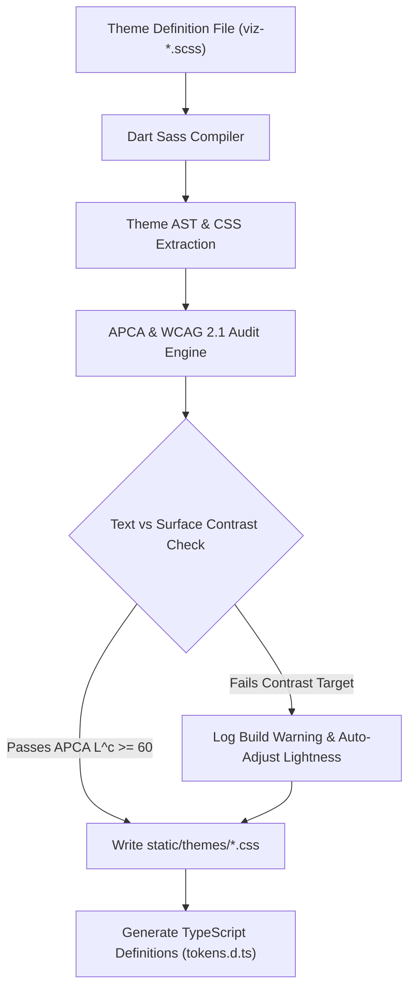

# Viz Design System 2.0 & Generative Theme Engine Plan

**Last Updated:** July 24, 2026

## Overview

This specification outlines the architecture, token schema, and implementation plan for **Viz Design System 2.0 (DS 2.0)**. 

The primary goal of DS 2.0 is to evolve from a monochrome, single-accent preprocessor model to a **perceptually uniform, multi-role generative theme engine**. It introduces explicit surface elevations, OKLCH color calculations, multi-color brand accents (e.g. GitLab Orange/Purple/Green), smooth runtime transitions, and **automated APCA/WCAG contrast auditing** at build time.

---

## 1. Motivation & Limitations of DS 1.0

| Feature | DS 1.0 (Current) | DS 2.0 (Proposed) |
| :--- | :--- | :--- |
| **Color Space** | Legacy HSL (`color.change($color, $lightness)`) | **OKLCH** (Perceptually uniform brightness) |
| **Light Mode Strategy** | Mathematical inversion (`100% - lightness`) | **Purpose-Crafted Light & Dark Schemas** |
| **Surface Tokens** | Generic numeric steps (`--viz-100` down to `--viz-5`) | **Semantic Elevations** (`surface-base`, `surface-panel`, `surface-card`) |
| **Brand Accents** | Monotonous single primary accent (`--viz-primary`) | **Multi-Role Accents** (`primary`, `secondary`, `accent`) |
| **Accessibility Audit** | Manual developer inspection | **Automated Build-Time APCA / WCAG 2.1 Audit** |
| **Theme Transitions** | Instant visual snap | **Smooth CSS cross-fade transitions** |

---

## 2. Architecture & Color Space

### Why OKLCH?
In traditional HSL, hue changes dramatically affect perceived brightness (e.g. 50% yellow appears blindingly bright, while 50% blue appears dark). 

OKLCH fixes this by separating **Lightness ($L$)**, **Chroma ($C$)**, and **Hue ($H$)** such that equal lightness values *look* equally bright to the human eye. This allows DS 2.0 to:
1. Guarantee consistent text contrast across all color hues.
2. Derive hover/active state variations programmatically without hue pollution.
3. Generate subtle container fills and focus rings safely.

---

## 3. Semantic Token Hierarchy

DS 2.0 replaces arbitrary step numbers with clear, functional token contracts:

### A. Surface Elevation Tokens
- `--viz-surface-base`: Main page canvas background.
- `--viz-surface-panel`: Navigation headers and sidebars.
- `--viz-surface-card`: Asset cards, table rows, and modal containers.
- `--viz-surface-popover`: Dropdown menus, tooltips, and floating context panels.
- `--viz-surface-input`: Text inputs, select elements, and search bars.

### B. Multi-Role Accent Tokens
- `--viz-primary-base`: Primary action color (e.g., `#fc6d26` GitLab Orange).
- `--viz-secondary-base`: Supporting brand color (e.g., `#6b4fbb` GitLab Purple).
- `--viz-accent-base`: Status & feature pop (e.g., `#108548` GitLab Green).

### C. Derived Component State Machine
For every accent role (`primary`, `secondary`, `accent`), the engine automatically generates derived states:

```css
/* Automatically derived by OKLCH engine */
--viz-primary-hover:  oklch(from var(--viz-primary-base) calc(l + 0.05) c h);
--viz-primary-active: oklch(from var(--viz-primary-base) calc(l - 0.05) c h);
--viz-primary-subtle: oklch(from var(--viz-primary-base) l 0.04 h / 0.12); /* Container fill */
--viz-primary-border: oklch(from var(--viz-primary-base) l 0.08 h / 0.35); /* Focus outline */
--viz-text-on-primary: oklch(98% 0 0); /* Auto-calculated contrast text */
```

### D. Text & Border Tokens
- `--viz-text-primary`: Primary headings and body copy (100% contrast).
- `--viz-text-secondary`: Subtitles, field labels, and metadata (70% contrast).
- `--viz-text-muted`: Placeholder text, timestamps, and subtle hints (50% contrast).
- `--viz-border-subtle`: 1px hairline division frames.
- `--viz-border-strong`: Active focus and selected state outlines.

---

## 4. Declarative Theme Definition Schema

Themes are defined as declarative maps in `src/lib/styles/scss/` (or `.theme.json` manifests).

### Example: Multi-Color GitLab Theme (`viz-gitlab.scss`)

```scss
@use "viz-engine" as engine;

$gitlab-theme: (
    name: "gitlab",
    
    // Explicit Dark Mode Palette
    dark: (
        bg-base:       oklch(18% 0.01 270),     // Deep canvas
        surface-panel: oklch(21% 0.02 285),     // Deep Indigo-Purple header/sidebar
        surface-card:  oklch(24% 0.02 270),     // Card surface
        border-subtle: oklch(35% 0.02 270 / 0.5),// Hairline frame
        text-main:     oklch(95% 0.005 270),    // Crisp text
        text-muted:    oklch(70% 0.01 270),     // Muted labels
        primary:       oklch(66% 0.22 35),      // GitLab Orange
        secondary:     oklch(52% 0.18 290),     // GitLab Purple
        accent:        oklch(58% 0.16 150)      // GitLab Green
    ),

    // Purpose-Crafted Light Mode Palette
    light: (
        bg-base:       oklch(98% 0.005 270),    // Crisp light canvas
        surface-panel: oklch(93% 0.015 285),    // Soft light purple-gray header/sidebar
        surface-card:  oklch(100% 0 0),         // Pure white cards
        border-subtle: oklch(88% 0.01 270),     // Soft border
        text-main:     oklch(20% 0.01 270),     // Dark text
        text-muted:    oklch(45% 0.01 270),     // Muted text
        primary:       oklch(60% 0.24 35),      // GitLab Orange (tuned for light mode)
        secondary:     oklch(48% 0.20 290),     // GitLab Purple
        accent:        oklch(48% 0.16 150)      // GitLab Green
    )
);

@include engine.register-theme($gitlab-theme);
```

---

## 5. Automated Build-Time APCA & WCAG Audit Engine

A key requirement of DS 2.0 is enforcing accessibility **at build time** inside [`viewfinder/tools/build-themes.js`](../../viewfinder/tools/build-themes.js).

### Audit Workflow



### Contrast Rules Enforced by Audit
1. **Body Text on Background / Card**: Minimum APCA score $L^c \ge 60$ (or WCAG 4.5:1).
2. **Large Headings**: Minimum APCA score $L^c \ge 45$ (or WCAG 3:1).
3. **Primary Button Text on Primary Accent**: Minimum APCA score $L^c \ge 60$.
4. **Subtle Interactive Icons**: Minimum WCAG 3:1 contrast against surface background.

---

## 6. Migration Strategy & Compatibility

To transition to DS 2.0 without breaking existing code:

### Step 1: Engine Implementation & Legacy Aliases
Add legacy CSS custom property mapping in `:root` so existing code continues to render cleanly:
```css
:root {
    --viz-100: var(--viz-surface-card);
    --viz-90:  var(--viz-surface-panel);
    --viz-80:  var(--viz-surface-base);
    --viz-60:  var(--viz-border-subtle);
}
```

### Step 2: Component Refactoring
Update Svelte components ([`Header.svelte`](../../viewfinder/src/lib/components/ui/Header.svelte), [`Sidebar.svelte`](../../viewfinder/src/lib/components/ui/Sidebar/Sidebar.svelte), [`ModalLightbox.svelte`](../../viewfinder/src/lib/components/modals/ModalLightbox.svelte), [`CollectionCard.svelte`](../../viewfinder/src/lib/components/ui/CollectionCard.svelte)) to use semantic tokens (`--viz-surface-panel`, `--viz-surface-card`, `--viz-primary-subtle`).

### Step 3: Automated Audit Integration
Integrate `color-contrast-calc` / APCA validator into `viewfinder/tools/build-themes.js`.

---

## 7. Next Steps

1. Create OKLCH synthesizer mixin in `src/lib/styles/scss/viz-engine.scss`.
2. Add APCA contrast validator into `tools/build-themes.js`.
3. Update `viz-gitlab.scss`, `viz-blue.scss`, and `viz-black.scss` to the new schema.
4. Generate `tokens.d.ts` for TypeScript autocompletion in Svelte.
